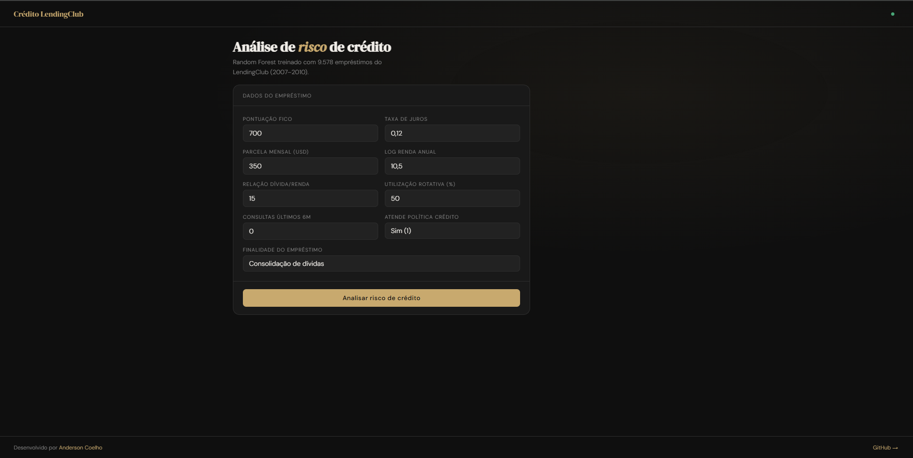
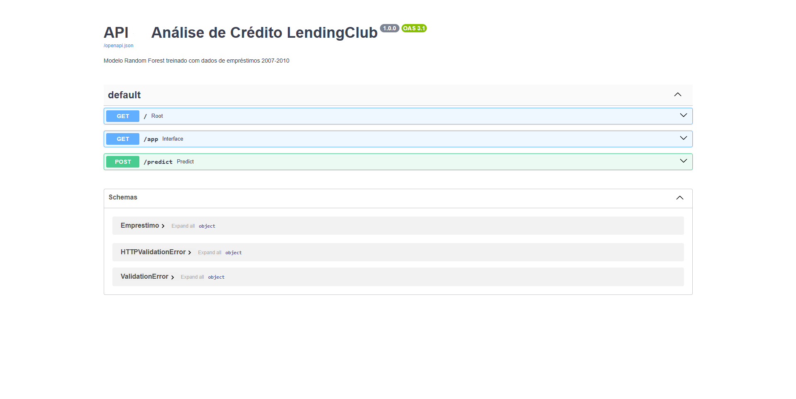
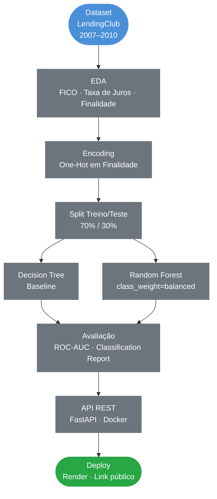
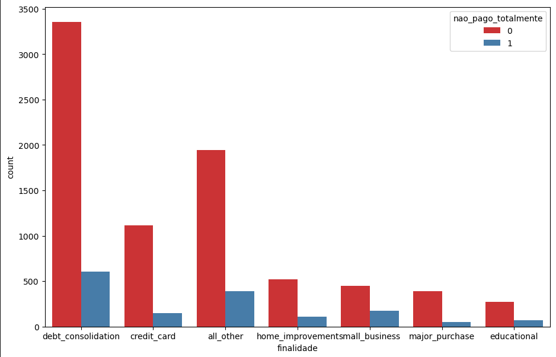
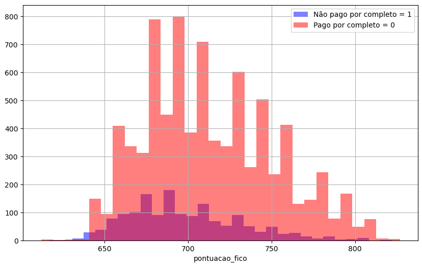
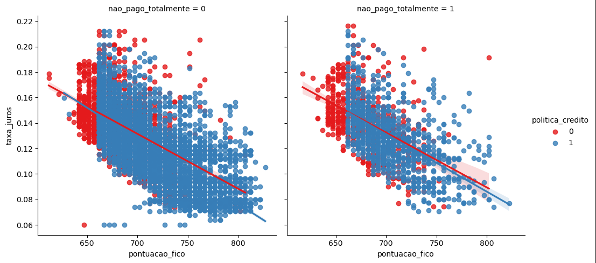
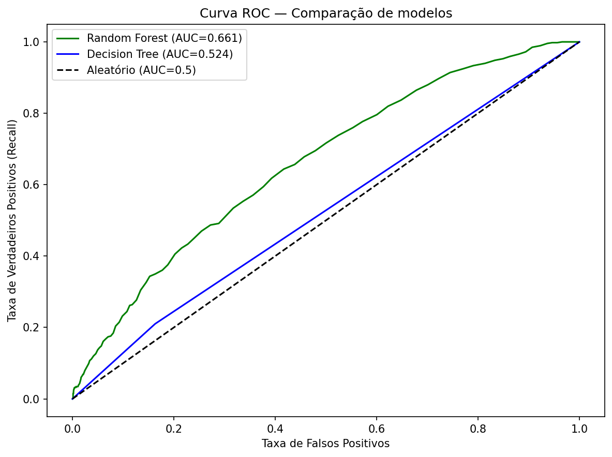
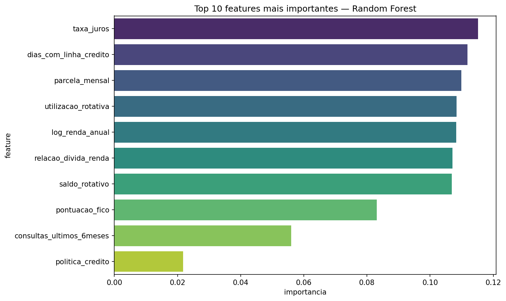

# Análise de Crédito em Dados do LendingClub

### EDA · Classificação · Random Forest · ROC-AUC · FastAPI · Docker · Deploy

&nbsp;

[](https://www.python.org/)
[](https://scikit-learn.org/)
[](https://fastapi.tiangolo.com/)
[](https://www.docker.com/)
[](https://api-credito-lendingclub.onrender.com)

&nbsp;
> Pipeline completo de Machine Learning para previsão de inadimplência em empréstimos pessoais,
> com foco em tratamento de dados desbalanceados, métricas adequadas para risco de crédito
> e deploy em produção com API REST containerizada.

&nbsp;

### Interface Interativa

[](https://api-credito-lendingclub.onrender.com/app)

> Acesse a interface em: **[api-credito-lendingclub.onrender.com/app](https://api-credito-lendingclub.onrender.com/app)**

### Documentação Swagger

[](https://api-credito-lendingclub.onrender.com/docs)

> Documentação completa da API em: **[api-credito-lendingclub.onrender.com/docs](https://api-credito-lendingclub.onrender.com/docs)**
---

## Índice

- [Contexto](#contexto)
- [Objetivos](#objetivos)
- [Pipeline do Projeto](#pipeline-do-projeto)
- [Tecnologias](#tecnologias-utilizadas)
- [Dataset](#dataset)
- [Análise Exploratória](#análise-exploratória)
- [Modelos Avaliados](#modelos-avaliados)
- [Principais Resultados](#principais-resultados)
- [API em Produção](#api-em-produção)
- [Estrutura do Repositório](#estrutura-do-repositório)
- [Autor](#autor)

---

## Contexto

Projeto de Machine Learning aplicado ao mercado de crédito, utilizando dados históricos da plataforma LendingClub que conecta tomadores e investidores de empréstimos pessoais. O modelo identifica mutuários com maior risco de não pagamento, apoiando decisões de concessão de crédito. O pipeline completo vai da análise exploratória ao deploy em produção como API REST containerizada.

| Etapa | Descrição |
|---|---|
| **EDA** | Análise do perfil FICO, taxas de juros e finalidades de empréstimo |
| **Encoding** | One-Hot Encoding na variável categórica `finalidade` |
| **Modelagem** | Decision Tree como baseline e Random Forest como modelo final |
| **Balanceamento** | `class_weight='balanced'` para tratar desbalanceamento de classes |
| **Avaliação** | ROC-AUC, curva ROC e importância de features |
| **Deploy** | API REST com FastAPI + Docker + Render |

---

## Objetivos

- Construir um modelo de classificação para prever inadimplência em empréstimos
- Comparar Decision Tree e Random Forest em dataset desbalanceado (~85% adimplentes)
- Aplicar `class_weight='balanced'` para melhorar a detecção de inadimplentes
- Avaliar com ROC-AUC métrica mais adequada que acurácia em problemas de crédito
- Criar uma API REST com FastAPI e containerizar com Docker
- Fazer deploy em produção com link público acessível

---

## Pipeline do Projeto



---

## Tecnologias Utilizadas

| Tecnologia | Uso no Projeto |
|---|---|
|  | Linguagem principal |
|  | Manipulação e análise dos dados |
|  | Operações numéricas |
|  | Modelos, métricas e curva ROC |
|  | Visualizações e curva ROC |
|  | Histogramas e gráficos exploratórios |
|  | API REST para servir o modelo em produção |
|  | Containerização da aplicação |
|  | Hospedagem do deploy em produção |

---

## Dataset

**Fonte:** [LendingClub](https://www.lendingclub.com) dados de empréstimos 2007–2010
**Uso:** Exclusivamente educacional

| Característica | Detalhe |
|---|---|
| Volume | ~9.578 empréstimos |
| Período | 2007 a 2010 |
| Variável target | `nao_pago_totalmente` (1 = inadimplente) |
| Desbalanceamento | ~85% adimplentes / ~15% inadimplentes |

**Principais variáveis:**

| Variável | Descrição |
|---|---|
| `pontuacao_fico` | Score de crédito do mutuário |
| `taxa_juros` | Taxa anual do empréstimo |
| `finalidade` | Objetivo do empréstimo (cartão, educação, negócio...) |
| `relacao_divida_renda` | Razão dívida/renda |
| `log_renda_anual` | Log da renda anual declarada |
| `politica_credito` | Se atende aos critérios da plataforma |

---

## Análise Exploratória

### Inadimplência por Finalidade do Empréstimo



> Empréstimos para pequenos negócios concentram maior proporção de inadimplentes em relação ao total de solicitações indicando maior risco por finalidade. Consolidação de dívidas é a categoria com maior volume absoluto.

### Distribuição FICO por Adimplência



> Inadimplentes (vermelho) apresentam distribuição FICO deslocada para scores mais baixos em relação aos adimplentes (azul) confirmando que a pontuação de crédito é um dos principais preditores de risco.

### FICO vs Taxa de Juros por Política de Crédito



> Relação inversa clara entre pontuação FICO e taxa de juros clientes com maior score recebem taxas menores. Clientes que não atendem à política de crédito (vermelho) concentram scores baixos e juros altos, independentemente do status de pagamento.

### Curva ROC Comparação de Modelos



| Modelo | ROC-AUC | Recall Classe 1 (inadimplente) |
|---|---|---|
| Decision Tree | menor | ~22% |
| **Random Forest (balanced)** | **maior** | **melhorado** |

> Em problemas de crédito, **liberar crédito para inadimplentes gera prejuízo direto**. Por isso o Recall da classe 1 e o ROC-AUC são as métricas prioritárias não a acurácia geral.

### Features Mais Importantes



> A pontuação FICO e a taxa de juros lideram em importância confirmando que o histórico de crédito e o risco percebido pelo mercado são os sinais mais fortes de inadimplência. A parcela mensal e a renda anual também contribuem significativamente.

---

## Principais Resultados

### Por que Random Forest com class_weight='balanced'?

| Aspecto | Decision Tree | Random Forest (balanced) |
|---|---|---|
| Acurácia geral | ~85% | ~85% |
| Recall inadimplentes | ~22% | melhorado |
| ROC-AUC | menor | **maior** |
| Estabilidade | baixa | alta |

> O `class_weight='balanced'` penaliza mais os erros na classe minoritária (inadimplentes), forçando o modelo a identificá-los melhor comportamento essencial em problemas de crédito onde **liberar crédito para inadimplentes gera prejuízo direto**.

### Aplicações do Modelo

- Apoio à decisão de concessão de crédito em fintechs e bancos
- Score de risco para triagem automática de solicitações
- Base para definição de limites de crédito por perfil de risco
- Deploy via API para integração com sistemas de análise de crédito

---

## API em Produção

### Interface Interativa

> Acesse a interface em: **[api-credito-lendingclub.onrender.com/app](https://api-credito-lendingclub.onrender.com/app)**

### Exemplo de Requisição

```bash
curl -X POST https://api-credito-lendingclub.onrender.com/predict \
  -H "Content-Type: application/json" \
  -d '{
    "politica_credito": 1,
    "taxa_juros": 0.12,
    "parcela_mensal": 350.0,
    "log_renda_anual": 10.5,
    "relacao_divida_renda": 15.0,
    "pontuacao_fico": 700,
    "dias_com_linha_credito": 3000,
    "saldo_rotativo": 10000,
    "utilizacao_rotativa": 50.0,
    "consultas_ultimos_6meses": 0,
    "atrasos_ultimos_2anos": 0,
    "registros_publicos": 0,
    "finalidade": "debt_consolidation"
  }'
```

### Resposta

```json
{
  "inadimplente": 0,
  "resultado": "Baixo risco de inadimplência",
  "probabilidade_inadimplencia": 0.1823,
  "probabilidade_pagamento": 0.8177,
  "modelo": "RandomForestClassifier"
}
```

### Endpoints disponíveis

| Método | Endpoint | Descrição |
|---|---|---|
| `GET` | `/` | Status da API |
| `GET` | `/app` | Interface interativa |
| `GET` | `/docs` | Documentação Swagger |
| `POST` | `/predict` | Análise de risco de crédito |

---

## Estrutura do Repositório

```
Analise_de_credito_em_dados_do_LendingClub/
│
├──  assets/                                   # Gráficos gerados na análise
│   ├── countplot_finalidade_inadimplencia.png
│   ├── histograma_fico_adimplencia.png
│   ├── lmplot_fico_juros_politica.png
│   ├── curva_roc.png
│   └── feature_importance_credito.png
│   └── modelo_em_funcionamento.png
│   └── Swagger_UI.png
├──  analise_de_credito_LendingClub.ipynb      # Notebook completo
├──  main.py                                   # API FastAPI
├──  index.html                                # Interface interativa
├──  Dockerfile                                # Containerização
├──  modelo_credito_lendingclub.pkl            # Modelo Random Forest treinado
├──  colunas_credito.pkl                       # Features esperadas pela API
├──  loan_data.csv                             # Dataset original
├──  requirements.txt                          # Dependências do projeto
└──  README.md                                 # Documentação do projeto
```

---

## Autor

<div align="center">


**Anderson Coelho**
*Cientista de Dados*

[](https://www.linkedin.com/in/anderson-coelho-42671634a/)
[](https://github.com/Anderson1999DC)

</div>

---

<div align="center">
